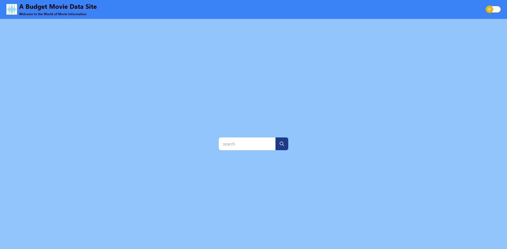

# Project-1

## Website URL
https://gkal14.github.io/Project-1/

## Goals
My team build this project because the client wanted a website where they are able to input a movie name and when clicked on; information about the movie is displayed, as well with ratings and the trailer for the movie.

## Problems and Solutions
A problem I encountered with the CSS framework 'Tailwind' was that we had to input many class codes in terms of styling, as there was no set code for a particular element; for example, the CSS framework 'Bootstrap' has predesigned css elements whereas Tailwind did not. Another problem that was faced was trying to fit the elements in together but through a lot of tampering my team eventually got certain elements to the places we want them.

## Completed Requirements
```
1. When the user searches for a movie they are presented with a list of movies with the movie they searched
2. When the user clicks on the movie they are presented with the following: movie poster, information on the movie (about, rating, type, release date, total run time, director, ticket sales), movie score (ratings), the trailer for said movie and links to where the movie can be watched (Netflix/Stan)
3. When the user clicks on the trailer of said movie, the trailer is played
4. When the user clicks on the "Netflix" or "Stan" link they transferred to the movie on their respective streaming site.
5. When the user searches for an invalid movie they are transferred to a 404 page.
6. When the user clicks on the main title "A Budget Movie Data Site" they are transferred back to the home page.
7. When the user clicks on the dark mode button, the background color changes successfully 
```

## Mock up

The following images show the web page appearance with dark mode disabled:




## The following images show the web page appearance with dark mode enabled:


## Features/Interactions/Points of Interests

1. When the user toggles on the dark mode, it persists throughout the site, when refreshed and when closed/reopened


